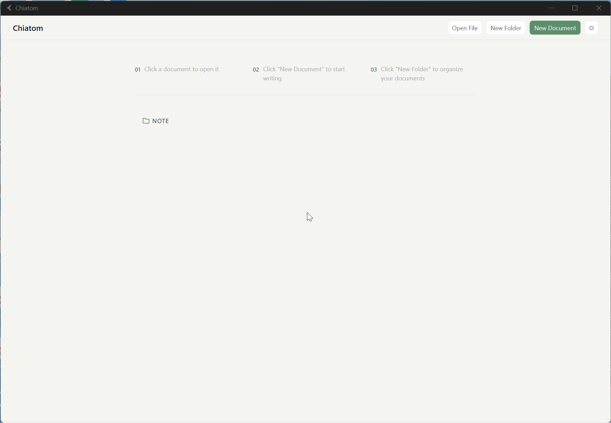
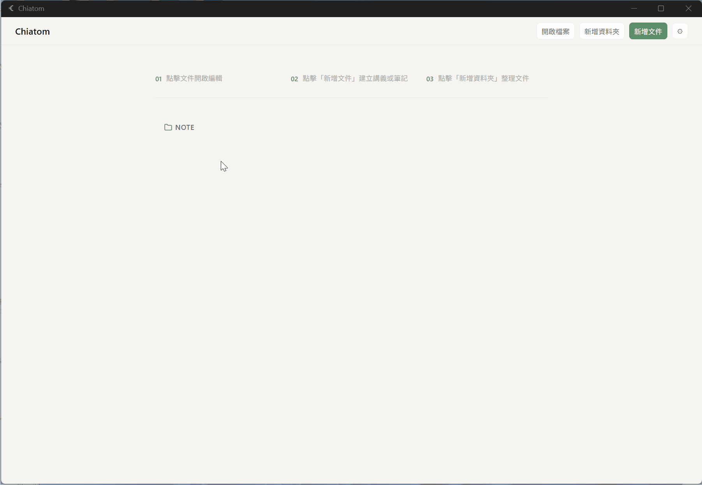

English | [繁體中文 ↓](#繁體中文)

# Chiatom



A block-based structured content editor built around A4 pages. What you edit is what you output.

---

## What is this

Chiatom is a desktop application for anyone who needs structured content creation with precise page output — teachers making handouts, knowledge workers who think better within boundaries, or anyone who wants to design a theme once and keep filling it with content.

Most tools don't solve a real problem: **whether you're making handouts or taking notes, existing tools are either too fluid (Notion's infinite canvas), too heavy (Word), or can't control final output (Typora).**

- Typora is a great Markdown editor, but you can't control where content appears on the page
- Notion's page feel is an illusion — print results are unpredictable
- Word can't apply custom HTML layouts
- For many people, a bounded page isn't a constraint — it's what makes focus possible

Chiatom's approach: pages are first-class citizens. You edit directly on an A4 page, and what you see is exactly what you get.

---

## Features


- **A4 page editing**: Each page is fixed to A4 size — true WYSIWYG
- **Block system**: Headings, paragraphs, lists, tables, blockquotes, images, and math equations (KaTeX)
- **Theme system**: Import custom theme packages (theme.css + theme.json), or use one of the three built-in themes
- **Compound blocks**: Custom blocks defined by the theme, inserted via the `/` command menu
- **Math support**: Inline and block LaTeX with live preview
- **HTML export**: A single self-contained HTML file with inline CSS and base64 images, ready to print as PDF in any browser
- **`.handout` format**: A packaged file format that bundles document data and image assets
- **Home screen**: Workspace-based file management with folders, drag-and-drop, and right-click menu
- **Auto-save**: 2-second debounce auto-save with unsaved changes protection on close
- **Appearance**: Light and dark themes, language and theme settings persisted across sessions

---

## Installation

### Download (Windows)

Download the latest installer from [GitHub Releases](https://github.com/dylan45132-jpg/chiatom/releases):

- `chiatom_0.2.0_x64-setup.exe` — Windows 10 / 11 (64-bit)

### Requirements

- Node.js 24.x
- pnpm 10.x
- Rust (required for Tauri builds)

### Build from source

```bash
# Clone the repository
git clone https://github.com/dylan45132-jpg/chiatom.git
cd chiatom

# Install dependencies
pnpm install

# Start in development mode
pnpm tauri dev

# Build for production
pnpm tauri build
```

The built installer will be in `src-tauri/target/release/bundle/`.

---

## Quick start

1. Launch the app — you'll see the home screen
2. Click "New Document" and enter a title to create your first document
3. Click "Theme" in the toolbar and pick a built-in theme (Slate / Washi / Moss)
4. Click "＋" in the left sidebar to add your first page
5. Type directly on the page, or press `/` to insert a block
6. When done, click "Export HTML" and open the file in a browser to print as PDF

---

## Themes

The visual style of your document is entirely controlled by themes. A theme package contains two files:

```
my-theme/
├── theme.css    # Page styles
└── theme.json   # Theme metadata and compound block definitions
```

To import: click "Theme" in the toolbar → "Import Folder", then select your theme folder.

Browse and download community themes at [chiatom-themes](https://dylan45132-jpg.github.io/chiatom-themes/).

For details on creating your own theme, see [docs/en/theme-guide.md](docs/en/theme-guide.md).

---

## Tech stack

| Layer | Choice |
|---|---|
| Desktop framework | Tauri v2 |
| Frontend | React 19 + TypeScript + Vite 7 |
| Editor engine | Tiptap 3.23.x |
| State management | Zustand 5.x |
| File format | JSZip (.handout) |

---

## Project status

- Phase 1 MVP ✅
- Phase 2 Full editing experience ✅
- Phase 3 Polish ✅
- Phase 4 Open source preparation ✅
- Phase 5 Home screen & workspace ✅

---

## License

Chiatom is open source under the [GNU General Public License v3.0](LICENSE).

Theme packages (theme.css + theme.json) are published separately under the MIT License, so the community can freely create, share, and sell themes without GPL restrictions.
See [chiatom-themes](https://github.com/dylan45132-jpg/chiatom-themes).

---

## 繁體中文

[English ↑](#chiatom) | 繁體中文

# Chiatom



以 A4 頁面為單位的區塊式結構化內容編輯器。你編輯的就是你輸出的。

---

## 這是什麼

Chiatom 是一個桌面應用，適合任何需要「邊界感 + 精確輸出」的結構化內容創作場景——製作講義的老師、用有框架感的方式記筆記的知識工作者，或任何想要「設計一次主題，長期填內容，最終輸出精美文件」的人。

現有工具都沒有解決一個真實問題：**無論是製作講義還是整理筆記，現有工具要麼太自由（Notion 的無限畫布）、要麼太重（Word）、要麼無法控制最終輸出（Typora）。**

- Typora 是最好的 Markdown 編輯器，但無法控制內容出現在頁面的哪個位置
- Notion 的頁面感是假的，列印結果不可預測
- Word 無法套用自訂 HTML 排版
- 對很多人來說，有邊界的頁面不是限制，而是專注的條件

Chiatom 的做法：頁面是一等公民。你在 A4 頁面上直接編輯，看到的就是最終輸出的樣子。

---

## 功能

- **A4 頁面編輯**：每個頁面固定 A4 尺寸，所見即所得
- **區塊系統**：標題、段落、清單、表格、引用、圖片、方程式（KaTeX）
- **主題系統**：匯入自訂主題包（theme.css + theme.json），或使用內建三套主題
- **複合區塊**：由主題定義的自訂區塊，透過 `/` 指令插入
- **方程式支援**：inline 和 block LaTeX，即時預覽
- **匯出 HTML**：單一自給自足的 HTML 檔案，圖片 base64 inline，可直接瀏覽器列印為 PDF
- **`.handout` 格式**：含圖片資產的打包存檔格式
- **主頁**：以 workspace 為基礎的文件管理，支援資料夾、拖曳排列、右鍵選單
- **自動儲存**：2 秒 debounce 自動儲存，關閉前未儲存變更保護
- **外觀設定**：淺色/深色主題切換，語言與主題設定跨 session 持久化

---

## 安裝

### 下載（Windows）

從 [GitHub Releases](https://github.com/dylan45132-jpg/chiatom/releases) 下載最新安裝檔：

- `chiatom_0.2.0_x64-setup.exe` — Windows 10 / 11（64 位元）

### 系統需求

- Node.js 24.x
- pnpm 10.x
- Rust（Tauri 建置需要）

### 從原始碼建置

```bash
# clone 專案
git clone https://github.com/dylan45132-jpg/chiatom.git
cd chiatom

# 安裝相依套件
pnpm install

# 開發模式啟動
pnpm tauri dev

# 建置正式版本
pnpm tauri build
```

建置完成後，安裝檔位於 `src-tauri/target/release/bundle/`。

---

## 快速開始

1. 啟動應用，看到主頁畫面
2. 點擊「新增文件」，輸入標題建立第一份文件
3. 點擊工具列的「主題」，選擇一套內建主題（Slate / Washi / Moss）
4. 點擊左側面板的「＋」新增第一個頁面
5. 在頁面上直接打字，或按 `/` 插入區塊
6. 完成後點擊「匯出 HTML」，用瀏覽器開啟後列印為 PDF

詳細的使用手冊請參考 [docs/zh/使用手冊.md](docs/zh/使用手冊.md)。

---

## 主題

Chiatom 的視覺風格完全由主題控制。主題包含兩個檔案：

```
my-theme/
├── theme.css    # 頁面樣式
└── theme.json   # 主題資訊與複合區塊定義
```

匯入方式：點擊工具列「主題」→「資料夾匯入」，選取主題資料夾。

在 [chiatom-themes](https://dylan45132-jpg.github.io/chiatom-themes/) 瀏覽並下載社群主題。

詳細的主題製作方式請參考 [docs/zh/主題製作指南.md](docs/zh/主題製作指南.md)。

---

## 技術棧

| 層級 | 選擇 |
|---|---|
| 桌面框架 | Tauri v2 |
| 前端 | React 19 + TypeScript + Vite 7 |
| 編輯器引擎 | Tiptap 3.23.x |
| 狀態管理 | Zustand 5.x |
| 存檔格式 | JSZip（.handout） |

---

## 專案狀態

- Phase 1 MVP ✅
- Phase 2 完整編輯體驗 ✅
- Phase 3 打磨 ✅
- Phase 4 開源準備 ✅
- Phase 5 主頁與工作區 ✅

---

## 授權

Chiatom 以 [GNU General Public License v3.0](LICENSE) 授權開源。

主題包（theme.css + theme.json）以 MIT 授權獨立發布，
社群可以自由製作、分享和販售主題，不受 GPL 限制。
詳見 [chiatom-themes](https://github.com/dylan45132-jpg/chiatom-themes)。