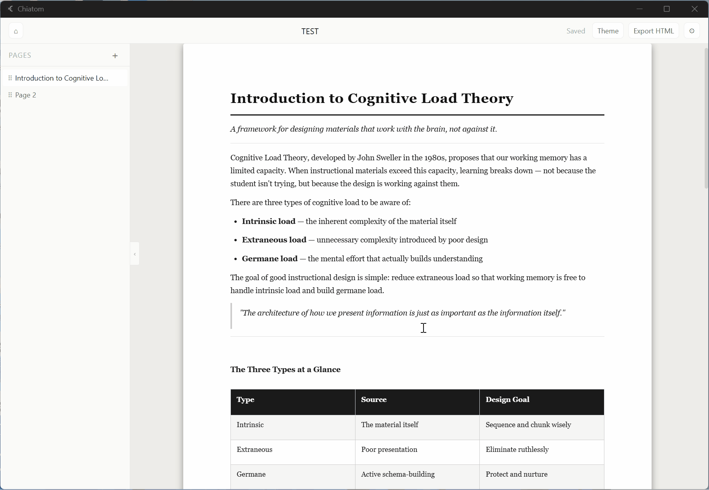
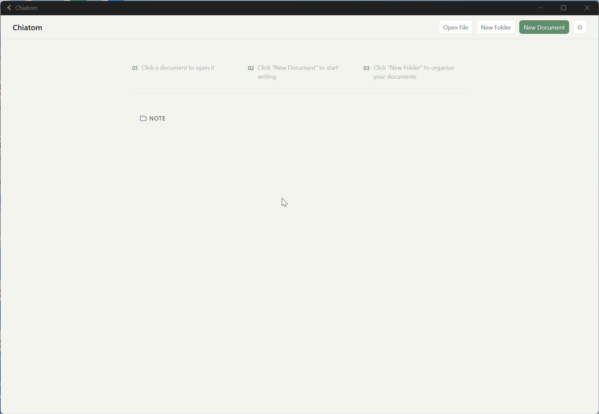
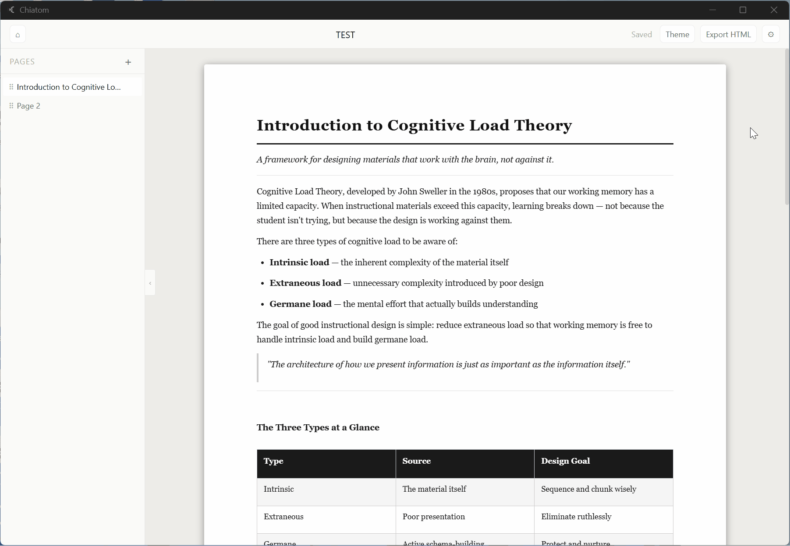

gemini -p "完整覆蓋 C:\chiatom\README.md，內容如下：

English | [繁體中文 ↓](#繁體中文)

# Chiatom

> The A4 page is part of the design itself — a WYSIWYG document editor built around the feeling of boundaries.
 
---
 
## Why I built this
 
The starting point was simple: I noticed that the 'infinite free canvas' of mainstream document editors was slowly killing my ability to think.
 
I'm not much of a layout person, but I care deeply about how things look — both when I'm writing and when I finally print or share them. That tension kept me drifting between note-taking apps for years. Eventually I cobbled together a clunky workflow: ask AI to build me a nice HTML template, fill in the content, and whenever things changed significantly, throw the whole file back to AI to reformat. It worked, but it was slow, token-hungry, and honestly — the logic was completely backwards.
 
*Fitting content into a beautiful layout should be the tool's job, not mine.*
 
Beyond that, there was a deeper problem it took me a long time to name: I just can't seem to think inside the kind of infinitely scrollable space that Notion or Obsidian offers. I focus better with boundaries. When a page ends, it ends — and that gives me a way to think about how each page should be shaped.
 
That feeling of 'when a page ends, it's done' — I don't think an endlessly scrolling canvas can ever give you that.
 
So I built Chiatom around a singular, almost regressive idea: **the A4 page is a first-class citizen.**
 
---
 
## The philosophy
 
I named this project after diatoms — single-celled organisms that construct incredibly precise, geometric silica shells in nature. Each shell is independent and complete. Chiatom follows the same logic: **your content goes into the container, and what comes out is a finished, standalone work.**
 
In Chiatom, what you see is exactly what you print. I deliberately removed the infinite scroll and gave you a single page with clear edges. When your text overflows the bottom, it doesn't automatically reflow to the next page — a red warning line appears instead. That is a design decision I feel strongly about.
 
Because that red line forces you to stop and ask yourself: *Is this page too crowded? Does this thought really belong here?*
 
When a page has a clear boundary and an ending, it means this stage of thinking is complete.
 
On the technical side, I made themes (CSS + JSON) completely decoupled from content. You can ask AI to design a layout on a whim, then spend all your future time just writing. Documents are saved as `.handout` files — ZIP packages that bundle your text and images together neatly. When you need to share your ideas, one click exports a single self-contained HTML file that prints perfectly in any browser.
 
I know Chiatom isn't for everyone. But if you're an educator who makes handouts, if you're tired of getting lost in boundless windows, or if you've ever spent a whole beautiful afternoon on layout and forgotten to actually write — this tool is for you.
 
Chiatom is for people who have realized: sometimes, drawing a box around yourself isn't a cage that limits your freedom — it's the steel frame that holds your thinking steady.

---

## Features

- **A4 page editing**: Each page is fixed to A4 size — true WYSIWYG. A red boundary line appears when content overflows, by design.
- **Block system**: Headings, paragraphs, lists, tables, blockquotes, images, and math equations (KaTeX)
- **Theme system**: Import custom theme packages (theme.css + theme.json), or use one of the three built-in themes (Slate / Washi / Moss)

- **Compound blocks**: Custom blocks defined by the theme, inserted via the \`/\` command menu
- **Math support**: Inline and block LaTeX with live preview
- **Project system**: Organize pages across documents into named projects. Add pages via right-click, view by document or literature (Zotero), and export a project as a single HTML file
- **@ references**: Type \`@\` in the editor to search and insert inline links to any page or document in your workspace. Click to jump directly to the referenced page
- **Zotero integration**: Link documents to papers via Better BibTeX, with author/year display and a literature view in the project console
- **HTML export**: A single self-contained HTML file with inline CSS and base64 images, ready to print as PDF in any browser
- **\`.handout\` format**: A packaged file format that bundles document data and image assets
- **Home screen**: Workspace-based file management with folders, drag-and-drop, and right-click menu
- **Auto-save**: 2-second debounce auto-save with unsaved changes protection on close
- **Appearance**: Light and dark themes, language and theme settings persisted across sessions

---

## Installation

### Download (Windows)

Download the latest installer from [GitHub Releases](https://github.com/dylan45132-jpg/chiatom/releases):

- \`chiatom_0.4.0_x64-setup.exe\` — Windows 10 / 11 (64-bit)

### Download (macOS)

Download \`Chiatom_0.4.0_x64.dmg\` from [GitHub Releases](https://github.com/dylan45132-jpg/chiatom/releases).

> **Note**: Chiatom for macOS is currently unsigned. To open it:
> 1. Open the \`.dmg\` and drag Chiatom to Applications
> 2. Double-click to open — when the warning appears, click **Cancel**
> 3. In Terminal, run:
>    \`\`\`
>    sudo xattr -rd com.apple.quarantine /Applications/Chiatom.app
>    \`\`\`
> 4. Open Chiatom again normally

---

## Quick start

1. Launch the app — you'll see the home screen
2. Click \"New Document\" and enter a title to create your first document
3. Click \"Theme\" in the toolbar and pick a built-in theme (Slate / Washi / Moss)
4. Click \"＋\" in the left sidebar to add your first page
5. Type directly on the page, or press \`/\` to insert a block
6. When done, click \"Export HTML\" and open the file in a browser to print as PDF

---

## Themes

The visual style of your document is entirely controlled by themes. A theme package contains two files:

\`\`\`
my-theme/
├── theme.css    # Page styles
└── theme.json   # Theme metadata and compound block definitions
\`\`\`

To import: click \"Theme\" in the toolbar → \"Import Folder\", then select your theme folder.

Browse and download community themes at [chiatom-themes](https://dylan45132-jpg.github.io/chiatom-themes/).

For details on creating your own theme, see [docs/en/theme-guide.md](docs/en/theme-guide.md).

---

## Tech stack

| Layer | Choice |
|---|---|
| Desktop framework | Tauri v2 |
| Frontend | React 19 + TypeScript + Vite 7 |
| Editor engine | Tiptap 3.23.x |
| State management | Zustand 5.x |
| File format | JSZip (.handout) |

---

## License

Chiatom is open source under the [GNU General Public License v3.0](LICENSE).

Theme packages (theme.css + theme.json) are published separately under the MIT License, so the community can freely create, share, and sell themes without GPL restrictions.
See [chiatom-themes](https://github.com/dylan45132-jpg/chiatom-themes).

---

## 繁體中文

[English ↑](#chiatom) | 繁體中文

# Chiatom

> A4 頁面本身也是設計的一部分——具備「邊界感」的所見即所得文件編輯器。

---

## 為什麼我做了這個

開發 Chiatom 的起點其實很單純：我發現主流文件編輯軟體的「無限自由畫布」，似乎正在慢慢扼殺我思考的能力。

我不是很會排版的人，但偏偏我又很在乎寫出來、印出來的東西到底好不好看。這種糾結讓我在各種筆記軟體間流浪了好幾年。後來，我妥協出了一套有點笨的工作流：先請 AI 幫我刻出漂亮的 HTML 版型，接著填入文字；一旦內容要大改，就把整份檔案丟回 AI 重新排版。這方法確實能運作，但實在太慢、也太消耗Token，而且講真的，這樣的邏輯根本不對。

*「把內容放進漂亮的排版」，應該是工具的工作，不是我的。*

除此之外，最深層的問題如開頭所述，我花了很長一段時間才終於釐清：自己好像一直沒辦法在Notion / Obsidian這種可以無限下滑的空間中思考，反而在有邊界的空間裡比較能專注，寫到一頁結束就是結束，我也能適時知道每一頁怎麼安排。

這種「一頁結束就是結束」的踏實感，我想應該是無限往下滾動的空間給不了的。

所以我圍繞著一個近乎復古的想法製作了 Chiatom：**A4 頁面是一等公民。**

---

## 設計哲學

這個專案的名字來自矽藻（diatom）——一種大自然中極度精確、幾何形矽殼的單細胞生物。每個殼都是獨立且完整的。Chiatom 遵循同樣的邏輯：**你的內容進入容器，出來的是一個完整的、獨立的作品。**

在 Chiatom 裡，你看到的東西就是你印出來的樣子。我刻意拿掉了無限滾動的視窗，只給你一個界線分明的頁面。當你的文字超出頁面底部時，它不會自動地幫你自動換到下一頁，而是出現紅色警告線提示。這是我非常堅持的設計決策。

因為這條紅線會強迫你停下來，問問自己：*這一頁是不是太擠了？這個想法真的適合塞在這裡嗎？*

當一頁有了明確的邊界與結尾，也就表示這個思考階段算是大功告成了。

在技術上，我讓主題（CSS + JSON）和內容徹底脫鉤。你可以心血來潮請 AI 幫你設計一次版型，然後在未來的日子裡，只要專心寫字就好。文件儲存為 `.handout` 格式（把文字和圖片妥善打包好的 ZIP 檔）。當你需要把想法傳遞給別人時，只要一鍵匯出成單一自給自足的 HTML 檔案，對方用任何瀏覽器打開，都能完美列印。

我知道，Chiatom 不會適合所有人。但如果你是需要編寫講義的教育工作者，如果你也厭倦了在無邊無際的視窗中迷失方向，又或者，你跟我一樣，曾經為了排版浪費掉整個美好的下午而忘記了寫作的初衷……那這款工具就是為你準備的。

Chiatom 是獻給那些意識到這件事的人：有時候，給自己畫一個框框，並不會成為限制自由的牢籠——而是成為穩定你思考的鋼架。

---

## 功能

- **A4 頁面編輯**：每個頁面固定 A4 尺寸，所見即所得。內容超出頁面時出現紅色邊界線，這是刻意的設計。
- **區塊系統**：標題、段落、清單、表格、引用、圖片、方程式（KaTeX）
- **主題系統**：匯入自訂主題包（theme.css + theme.json），或使用內建三套主題（Slate / Washi / Moss）

- **複合區塊**：由主題定義的自訂區塊，透過 \`/\` 指令插入
- **方程式支援**：inline 和 block LaTeX，即時預覽
- **專案系統**：跨文件的頁面脈絡組織工具。右鍵加入頁面、依文件或文獻分組瀏覽，並可將專案匯出為單一 HTML
- **@ 引用**：在編輯器內輸入 \`@\` 搜尋 workspace 內的文件與頁面，插入行內連結，點擊直接跳轉
- **Zotero 整合**：透過 Better BibTeX 連結文獻，顯示作者與年份，專案控制台提供文獻視圖
- **匯出 HTML**：單一自給自足的 HTML 檔案，圖片 base64 inline，可直接瀏覽器列印為 PDF
- **\`.handout\` 格式**：含圖片資產的打包存檔格式
- **主頁**：以 workspace 為基礎的文件管理，支援資料夾、拖曳排列、右鍵選單
- **自動儲存**：2 秒 debounce 自動儲存，關閉前未儲存變更保護
- **外觀設定**：淺色/深色主題切換，語言與主題設定跨 session 持久化

---

## 安裝

### 下載（Windows）

從 [GitHub Releases](https://github.com/dylan45132-jpg/chiatom/releases) 下載最新安裝檔：

- \`chiatom_0.4.0_x64-setup.exe\` — Windows 10 / 11（64 位元）

### 下載（macOS）

從 [GitHub Releases](https://github.com/dylan45132-jpg/chiatom/releases) 下載 \`Chiatom_0.4.0_x64.dmg\`。

> **注意**：macOS 版本目前未簽名，首次開啟需要以下步驟：
> 1. 開啟 \`.dmg\`，將 Chiatom 拖入 Applications
> 2. 雙擊開啟，出現安全警告時點「取消」
> 3. 在 Terminal 輸入：
>    \`\`\`
>    sudo xattr -rd com.apple.quarantine /Applications/Chiatom.app
>    \`\`\`
> 4. 重新開啟 Chiatom

---

## 快速開始

1. 啟動應用，看到主頁畫面
2. 點擊「新增文件」，輸入標題建立第一份文件
3. 點擊工具列的「主題」，選擇一套內建主題（Slate / Washi / Moss）
4. 點擊左側面板的「＋」新增第一個頁面
5. 在頁面上直接打字，或按 \`/\` 插入區塊
6. 完成後點擊「匯出 HTML」，用瀏覽器開啟後列印為 PDF

詳細的使用手冊請參考 [docs/zh/使用手冊.md](docs/zh/使用手冊.md)。

---

## 主題

Chiatom 的視覺風格完全由主題控制。主題包含兩個檔案：

\`\`\`
my-theme/
├── theme.css    # 頁面樣式
└── theme.json   # 主題資訊與複合區塊定義
\`\`\`

匯入方式：點擊工具列「主題」→「資料夾匯入」，選取主題資料夾。

在 [chiatom-themes](https://dylan45132-jpg.github.io/chiatom-themes/) 瀏覽並下載社群主題。

詳細的主題製作方式請參考 [docs/zh/主題製作指南.md](docs/zh/主題製作指南.md)。

---

## 技術棧

| 層級 | 選擇 |
|---|---|
| 桌面框架 | Tauri v2 |
| 前端 | React 19 + TypeScript + Vite 7 |
| 編輯器引擎 | Tiptap 3.23.x |
| 狀態管理 | Zustand 5.x |
| 存檔格式 | JSZip（.handout） |

---

## 授權

Chiatom 以 [GNU General Public License v3.0](LICENSE) 授權開源。

主題包（theme.css + theme.json）以 MIT 授權獨立發布，
社群可以自由製作、分享和販售主題，不受 GPL 限制。
詳見 [chiatom-themes](https://github.com/dylan45132-jpg/chiatom-themes)。"